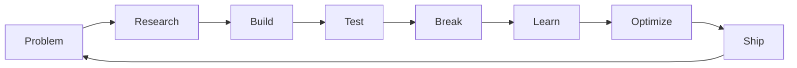

# Hi 👋, I'm **Mohammad Ghous Mujtaba**

<div align="center">
  
### 🚀 Frontend Web Developer | ☁️ Cloud & Automation Explorer

[](https://git.io/typing-svg)

</div>

---

## 💫 About Me

<table>
<tr>
<td width="50%">

- 🚀 Focused on **clean code, performance & scalability**
- 🧠 Strong in **HTML, CSS, JavaScript, React**
- ☁️ Exploring **AWS Cloud Infrastructure**
- 🔁 Learning **n8n Automation & Workflows**
- 🛠️ I learn by **building → breaking → rebuilding**
- 📈 Obsessed with **DX & optimization**

</td>
<td width="50%">

```javascript
const developer = {
  name: "Mohammad Ghous",
  role: "Frontend Dev",
  location: "India 🇮🇳",
  languages: ["JavaScript", "HTML", "CSS"],
  frameworks: ["React"],
  currentFocus: ["AWS", "n8n"],
  motto: "Build. Break. Learn."
};
```

</td>
</tr>
</table>

---

## 🌐 Connect With Me

<div align="center">

[](https://instagram.com/mohammadghousmujtaba)
[](https://linkedin.com/in/mohammad-ghous-mujtaba-476505221)
[](https://x.com/ghous_mujtaba)
[](mailto:tech.mujtaba@gmail.com)

</div>

---

## 💻 Tech Stack

<div align="center">

### 🌐 Frontend Development


### 🔧 Tools & Cloud


</div>

---

## 🧭 Currently Learning

<div align="center">

[](https://git.io/typing-svg)

</div>

---

## 🚀 What I'm Working On

<div align="center">

| 🎯 Focus Area | 📝 Description | 🛠️ Tech |
|:---:|:---:|:---:|
| **React Projects** | Building scalable web apps | React, JS |
| **Cloud Computing** | AWS infrastructure & services | AWS, Cloud |
| **Automation** | Workflow automation | n8n, APIs |
| **Learning** | System design & optimization | Various |

</div>

---


---

## 📈 Contribution Graph

<div align="center">

[](https://github.com/ashutosh00710/github-readme-activity-graph)

</div>

---

## ✨ Dev Philosophy

<div align="center">

### 💭 Code With Purpose

```
┌─────────────────────────────────────┐
│  "Code is like humor.                │
│   When you have to explain it,      │
│   it's bad."                         │
│                    – Cory House      │
└─────────────────────────────────────┘
```

**My Development Cycle:**



</div>

---

## 🔥 Featured Projects

<div align="center">

<table>
<tr>
<td align="center" width="50%">

### 🎨 Portfolio Website
**Personal portfolio showcasing projects**


</td>
<td align="center" width="50%">

### ⚡ Task Manager
**Productivity app with local storage**


</td>
</tr>
<tr>
<td align="center" width="50%">

### 🌤️ Weather Dashboard
**Real-time weather with API integration**


</td>
<td align="center" width="50%">

### 🔄 Automation Workflows
**n8n workflow automation**


</td>
</tr>
</table>

</div>

---

## 📚 Learning Journey

<div align="center">

```ascii
     ⭐ Current Focus ⭐
    
    ┌─────────────────┐
    │   Frontend      │ ████████░░ 80%
    ├─────────────────┤
    │   React         │ ███████░░░ 70%
    ├─────────────────┤
    │   AWS Cloud     │ ████░░░░░░ 40%
    ├─────────────────┤
    │   Automation    │ ███░░░░░░░ 30%
    ├─────────────────┤
    │   System Design │ ██░░░░░░░░ 20%
    └─────────────────┘
```

</div>

---

## 🎯 2026 Goals

<div align="center">

- [x] Master React fundamentals
- [x] Build 5+ real-world projects
- [ ] AWS Certified Cloud Practitioner
- [ ] Build a full-stack application
- [ ] Contribute to open source
- [ ] Master n8n automation

</div>

---

<div align="center">

### 📊 Profile Stats


---

### ⚡ Crafted with passion, curiosity, and caffeine ☕

**Made with ❤️ by Mohammad Ghous Mujtaba**

---

<sub>⭐ From [mujtaba-siddique](https://github.com/mujtaba-siddique) | Last Updated: April 2026</sub>

</div>
