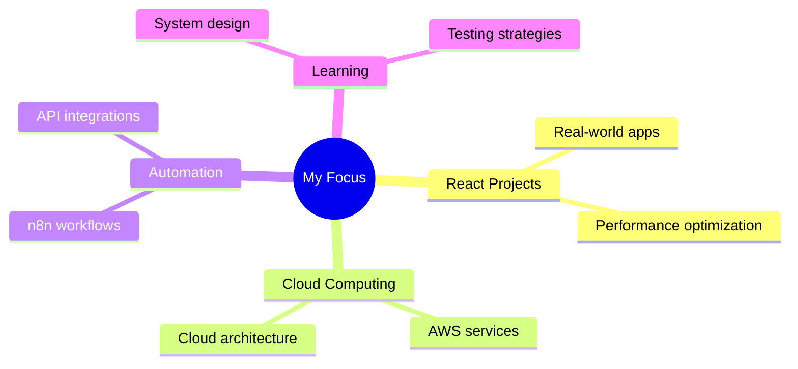

# Hi 👋, I'm **Mohammad Ghous Mujtaba**

<div align="center">
  
### 🚀 Frontend Web Developer | ☁️ Cloud & Automation Explorer

[](https://git.io/typing-svg)

</div>

---

## 💫 About Me

<div align="right">
  
```javascript
const developer = {
  name: "Mohammad Ghous Mujtaba",
  role: "Frontend Developer",
  location: "India 🇮🇳",
  skills: ["React", "JavaScript", "AWS", "n8n"],
  learning: ["Cloud Architecture", "Automation"],
  philosophy: "Build → Break → Learn → Rebuild"
};
```

</div>

- 🚀 Focused on **clean code, performance & scalability**
- 🧠 Strong in **HTML, CSS, JavaScript, React**
- ☁️ Exploring **AWS Cloud Infrastructure**
- 🔁 Learning **n8n Automation & Workflows**
- 🛠️ I learn by **building → breaking → rebuilding**
- 📈 Obsessed with **DX & optimization**

---

## 🌐 Connect With Me

<div align="center">

[](https://instagram.com/mohammadghousmujtaba)
[](https://linkedin.com/in/mohammad-ghous-mujtaba-476505221)
[](https://x.com/ghous_mujtaba)
[](mailto:tech.mujtaba@gmail.com)

</div>

---

## 💻 Tech Stack

### 🌐 Frontend


### 🔧 Tools & Platforms


---

## 🧭 Currently Learning

<div align="center">

[](https://git.io/typing-svg)

</div>

---

## 🚀 What I'm Working On



---

## 📊 GitHub Analytics

<div align="center">


</div>

---

## 🏆 Achievements

<div align="center">


</div>

---

## ✨ Dev Philosophy

<div align="center">

> *"First, solve the problem. Then, write the code."* – John Johnson

**My Approach:**
```
Problem → Research → Build → Test → Break → Learn → Optimize → Ship
```

</div>

---

## 📈 Activity Graph

<div align="center">

[](https://github.com/ashutosh00710/github-readme-activity-graph)

</div>

---

## 🔥 Recent Projects

<div align="center">

| Project | Description | Tech Stack |
|---------|-------------|------------|
| 🎯 **Portfolio** | Personal portfolio website | React, CSS3 |
| ⚡ **Task Manager** | Productivity app | React, Local Storage |
| 🌤️ **Weather App** | Real-time weather data | React, API |
| 🔄 **Automation Bot** | Workflow automation | n8n, APIs |

</div>

---

<div align="center">


### ⚡ Crafted with passion, curiosity, and caffeine ☕

**Made with ❤️ by Mohammad Ghous Mujtaba**

</div>

---

<div align="center">

### 💭 Random Dev Quote


</div>
